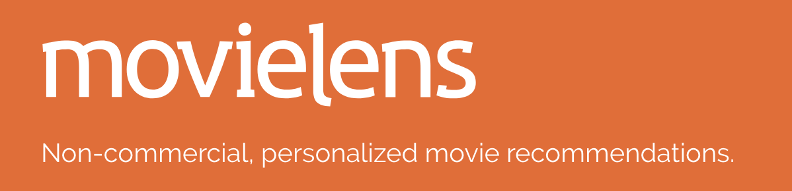
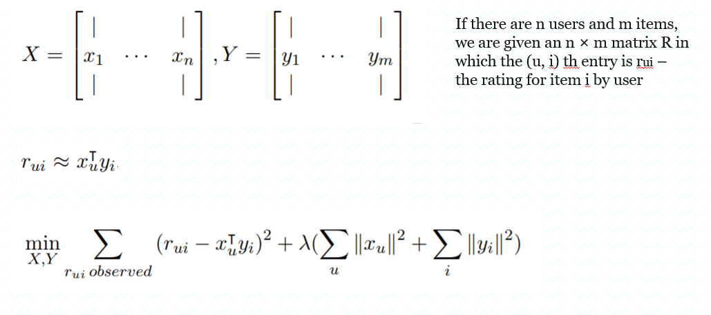
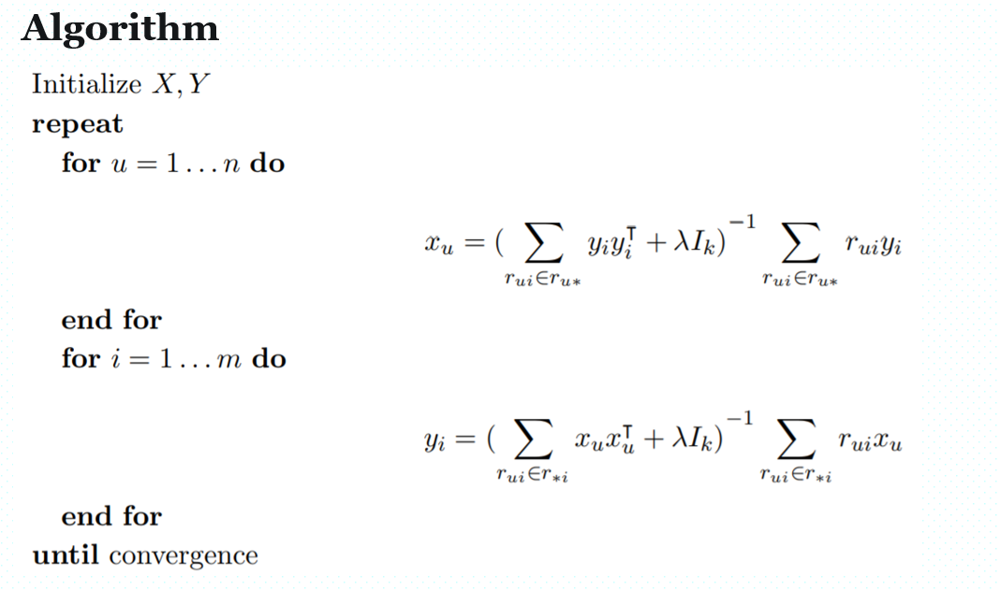

# ADS Project 5: 

Term: Fall 2018

+ Team # 5
+ Projec title: Recommendation System 
--Using Spark Platform

+ Team members

	+ Xie, Yiding yx2443@columbia.edu
	
	+ Xing, Yang yx2416@columbia.edu
	
	+ Zhou, Zhibo zz2520@columbia.edu


+ Project summary: In this project, we applied Alternating Least Square algorithm on Spark platform to provide movie recommendations to clients. We obtained data from 'Movielens', it has over 27 million ratings and more than 58 thousand movies.


The general idea is following:


+ The basic algorithm is the following:

The running time for our model is 97.435 second.

+ Performance
The RMSE for our model is 0.8188. (Similar competitions were hosted by Netflix and their best RMSE is 0.9514.

+ Enviornment: emr - 5.19.0, Spark 2.3.2 on Hadoop 2.8.5 YARN with Ganglia 3.7.2 and Zeppelin 0.8.0
               master: m5.4xlarge 
	       slaves: 3 * m5.4xlarge
	
**Contribution statement**: ([default](doc/a_note_on_contributions.md)) All team members are major contributors in this project. All team members approve our work presented in this GitHub repository including this contributions statement. 

Following [suggestions](http://nicercode.github.io/blog/2013-04-05-projects/) by [RICH FITZJOHN](http://nicercode.github.io/about/#Team) (@richfitz). This folder is orgarnized as follows.

```
proj/
├── lib/
├── data/
├── doc/
├── figs/
└── output/
```

Please see each subfolder for a README file.
